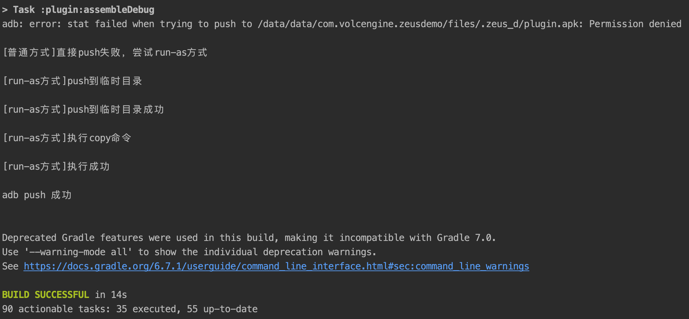

## 脚手架项目结构简介
- app：脚手架中的宿主模块，也可以看作是真实环境中的用户侧应用，主要用于测试SDK功能。
- plugin-api：脚手架工程的API层，您可以在其中定义SDK中的接口。API层的最终产物为一个.aar文件或Maven坐标，提供给用户进行接入。用户可以通过调用其中的方法，从而实现对SDK的使用。
- plugin-impl：脚手架工程的实现层，您可以将SDK中需要实现动态化的代码放在此处。
- zeus-config：脚手架工程核心配置文件。通常情况下，您只需要修改此目录下的配置文件即可。
    - config.json5：
        - plugins节点：描述了脚手架工程中的所有插件。
        - common节点：描述了脚手架工程中的公共配置。
    - plugin.gradle：SDK的主配置文件，在这里对SDK编译时的选项进行配置。并且在编译阶段会进行相应配置检测，如果检测不通过则编译失败，编译失败时可以根据报错信息进行修改。 例如：四大组件占桩检测、资源keep检测、类keep检测等。
    - plugin_api.gradle：SDK API层配置文件，您可以在此处添加API层的依赖。
    - plugin_impl.gradle：SDK 实现层的配置文件，您可以在此处添加实现层的依赖。

## 快速启动
1. 直接运行App module，此时会发现界面中提示插件未安装。
 

2. 执行`./gradlew plugin:clean plugin:assembleDebug`命令，然后重启App，会发现插件已经安装好了，并且通过点击按钮也可以跳转到插件Activity中
    - plugin module的输出产物是插件，执行该命令会自动编译一个插件apk出来。
    - 在调试阶段，我们可以通过adb命令把插件push到sd卡中即可使插件生效。由于在高版本系统中adb push有权限问题，push比较麻烦，因此我把push逻辑写到了gradle/zeus/common_plugin.gradle文件中，每次执行assemble之后会自动进行adb push。如下图表示push的流程（即使push失败，插件apk也是编译成功的）。
 

    
    
